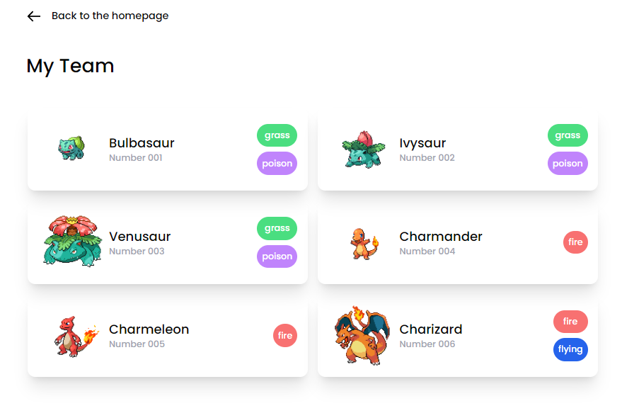

# DevAtWork-Interview-React

The Project is for an assignment of DevAtWork.

# Table of Contents

- [DevAtWork-Interview-React](#devatwork-interview-react)
- [Table of Contents](#table-of-contents)
  - [The Goal of this project](#the-goal-of-this-project)
  - [The Stack](#the-stack)
  - [Features](#features)
  - [What i used in React](#what-i-used-in-react)
  - [Functionalities](#functionalities)
    - [Search Pokemon](#search-pokemon)
    - [Add Pokemon to My Team](#add-pokemon-to-my-team)
  - [The API](#the-api)
  - [The Design](#the-design)
    - [The Homepage](#the-homepage)
    - [The Single Page](#the-single-page)
    - [My Team Page](#my-team-page)
    - [Error Page (404)](#error-page-404)
  - [How to run the project](#how-to-run-the-project)
    - [Clone & Run the project](#clone--run-the-project)
  - [Contact](#contact)

## The Goal of this project

The client is a bigged fan of the first generation "Pokemon". He wanted to create a website, to see all the Pokemon of the first generation. He also wanted to be able to search for a specific Pokemon and see its details. He also wanted to be able to add a Pokemon to his team.

## The Stack

- [x] React
- [x] Tailwind
- [x] React Router
- [x] Typescript
- [x] Axios
- [x] ViteJS
- [x] Github & Git

## Features

- [x] Pokemon List (Homepage)
- [x] Pokemon Details (Single Page)
- [x] My Team ( 6 Pokemons )
- [x] Search Pokemon
- [x] Add Pokemon to My Team
- [x] Remove Pokemon from My Team
- [x] Team FULL when 6 Pokemons are added
- [x] Responsive Design
- [x] Error Page (404)
- [x] Loading Screen
- [x] API Calls

## What i used in React

- [x] React Router
- [x] React Params in URL
- [x] React Custom Hooks
- [x] React UseEffect
- [x] React UseState
- [x] React UseCallBack
- [x] React Typescript

## Functionalities

### Search Pokemon


### Add Pokemon to My Team


## The API


The API for the single page is provided by [PokeAPI](https://pokeapi.co/).


The API for the homepage is provided by [StopLight](https://stoplight.io/mocks/appwise-be/pokemon/57519009).

## The Design

### The Homepage


### The Single Page


### My Team Page



### Error Page (404)


## How to run the project

### Clone & Run the project

HTTPS

```bash
git clone https://github.com/LunashaGit/DevAtWork-Interview-React.git
cd DevAtWork-Interview-React
npm i && npm run dev
```

SSH

```bash
git clone git@github.com:LunashaGit/DevAtWork-Interview-React.git
cd DevAtWork-Interview-React
npm i && npm run dev
```

## Contact

- LinkedIn : [Luna Muylkens](https://www.linkedin.com/in/luna-muylkens/) | Email : lunamuylkens@gmail.com
